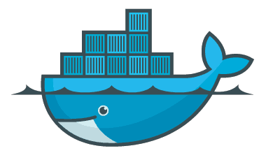
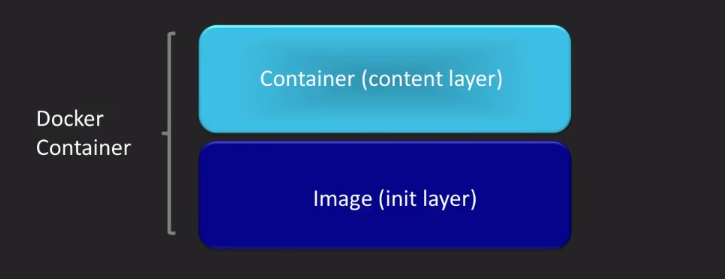
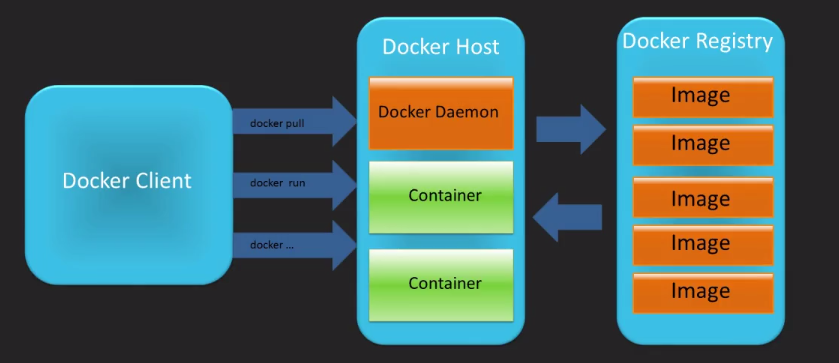

!SLIDE center transition=scrollUp

# Docker

!SLIDE transition=scrollUp
# Conceitos sobre Docker

**Principais Componentes**

- Images
- containers
- Dockerfiles
- Registries

!SLIDE transition=scrollUp
# Images

- Imagens são templates para criação de containers, basicamente um filesystem e tipo de metadado sobre como o container deve ser construido e sobre o que o container deve rodar;

- Se você precisar mover ou transportar um container entre dois ambientes por exemplo, poderá fazer isso através do uso de imagens;

- O docker é responsável pela manipulação de imagens dentro de um host e fornecimento das ferramentas para transporte de imagens que por sua vez são armazenadas em Registries;

.callout.info `Dai a facilidade na manipulação de containers, a mesma imagem utilizada localmente pelo Developer é enviada a um registry e baixada para uso em produção, nem da mais pra usar a belissima desculpa: "Na minha máquina Rodou"`
s;

!SLIDE transition=scrollUp
# Containers

- Containers são instancias de uma imagem em execução, basicamente cópias a partir deles; 

- É a partir dos containers que rodamos processos baseados nas especificações da imagem, por exemplo um node ou um tomcat;

- O Docker manipula os containers como se fossem processos sendo possível rodar, pausar ou parar um container via linha de comando;

.callout.info `Podemos executar alterações diretamente no container mas para que esses dados persistam é necessario que as alterações sejam replicadas na imagem`

!SLIDE transition=scrollUp
# Dockerfiles

- Docker files são receitas ou arquivos de build contendo a informação sobre como um container deverá construir uma nova imagem ( Execução de um build );

- O uso de dockerfile permite ao desenvolvedor manter a especificação da sua infra transformando isso em código, na maioria dos casos adicionado ao Github junto com o projeto como [Neste Exemplo](https://github.com/spring-guides/gs-spring-boot-docker/blob/master/complete/Dockerfile);

!SLIDE transition=scrollUp
# Registries

- Estruturas de Registries são utilizadas para armazenar imagens;

- Essas imagens são geradas via Dockerfile localmente durante o processo de Build e enviadas a um registry;

- O Docker mantém um registry no modelo "freemium" que pode ser usado para armazenamento de imagens, o acesso pode ser feito pela URL [https://hub.docker.com/](https://hub.docker.com/);

!SLIDE transition=scrollUp
# Layers

Quando iniciamos um container ele sempre é baseado em uma imagem, o container compõe essa imagem com base em layers, de acordo com a imagem original no registry;

.callout.info `Esse modelo facilita o processo de pull e armazenamento de imagens, uma vez que as layers são compartilhadas mantendo as imagens em tamanhos pequenos (Geralmente menos de 200mb)`

!SLIDE transition=scrollUp
# Layers

Na pratica a relação entre o processo de pull o uso do registry e dos hosts que orquestram os containers pode ser descrita dessa forma:

