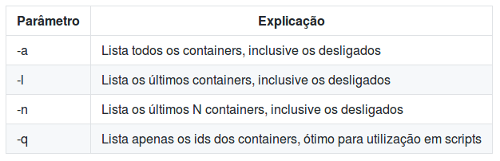

!SLIDE transition=scrollUp
# Criando imagens

**Como criar um Dockerfile para entregar seu código?**

- A estratégia mais simples e eficiente para geração de uma imagem é a construção de um Dockerfile, 

- Um Dockerfile é basicamente um arquivo texto contendo uma relação de instruções de linha de comando que farão a composição da imagem de seu container;

- A imagem é baseada em uma imagem base pré existente no [Dockerhub](https://hub.docker.com/_/openjdk/), neste exemplo utilizaremos uma imagem com openjdk rodando [Alpine](https://alpinelinux.org/);

!SLIDE transition=scrollUp
# Criando imagens

**Criando um Dockerfile:**

    @@@shell
    FROM openjdk:8-jdk-alpine
    ADD target/gs-spring-boot-docker-0.1.0.jar app.jar
    ENV JAVA_OPTS="-Xmx256m -Xms128m"
    ENTRYPOINT [ "sh", "-c", "java $JAVA_OPTS -jar /app.jar" ]

Esse exemplo foi baseado no [spring.io](https://spring.io/guides/gs/spring-boot-docker/) e pode ser baixado a partir [Deste Link](https://stash.uol.intranet/projects/PAEIK/repos/demos/browse/hackaday/_build/Dockerfile?at=81a76574877517df2485ed972ffa4c4a0f86b15e&raw);

.callout.warning `Não odeixe de ajustar os valores definidos na variável JAVA_OPTS de acordo com o sizing da sua aplicação.`

!SLIDE commandline incremental transition=scrollUp
# Criando imagens

Acesse o diretório com o Projeto de Exemplo e em seguida faça o build do Projeto:
   
    $ docker build -t hello_spring:version1.0 .

O container será disponibilizado no seu ambiente local:

    $ docker images

.callout.info `O exemplo baseia-se no modelo proposto no ***spring.io***, Você encontrará a versão completa na [Documentação do Projeto](https://spring.io/guides/gs/spring-boot-docker/#initial)`

!SLIDE commandline incremental transition=scrollUp
# Rodando Containers

Com a imagem criada podemos iniciar o container:

    $ docker run -p 8080:8080 -t hello_spring:version1.0
    
Os parâmetros mais comuns na execução de containers foram listados abaixo;

!SLIDE commandline incremental transition=scrollUp
# Listando Containers

Abra um segundo terminal, visualize a lista de containers rodando:

    $ docker ps
    CONTAINER ID     IMAGE                     COMMAND         CREATED ...
    7b058f5b8a2c     hello_spring:version1.0   "java"          7 seconds ago

A relação de parâmetros para esse comando pode ser consultada abaixo:

!SLIDE commandline incremental transition=scrollUp
# Exibição de Logs

É possível obter logs de containers em execução com o comando docker logs 

***sintaxe:*** docker logs ${OPTIONS} ${CONTAINER_NAME}

    $ docker logs 7b058f5b8a2c
    
.callout.info `Uma boa prática ligada ao uso de containers indica que aplicações não devem gerenciar ou rotear arquivos de log, esse logs devem ser depositados sem qualquer esquema de buffer na saída padrão (STDOUT);`

.callout.info `Fica por conta de uma infraestrutura externa à aplicação o armazenamento e gerenciamento desses dados;`