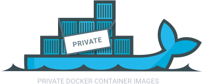
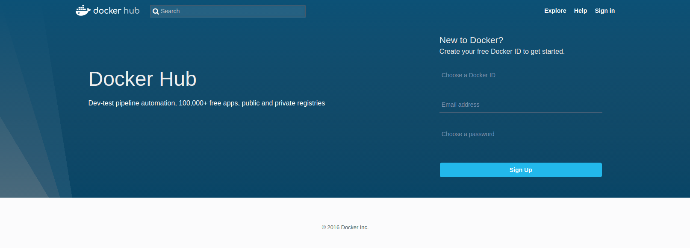
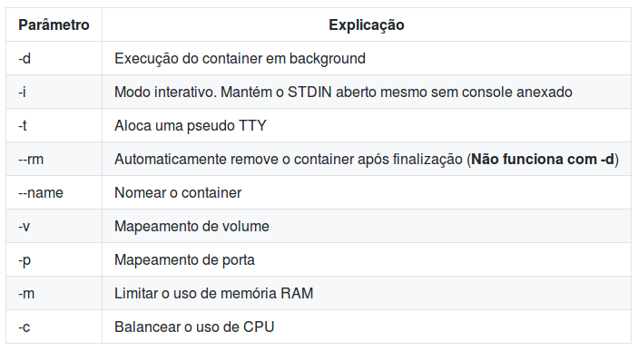

!SLIDE center transition=scrollUp

# Dockerfiles 

!SLIDE transition=scrollUp
# Criando imagens

**Como criar um Dockerfile para entregar seu código?**

- A estratégia mais simples e eficiente para geração de uma imagem é a construção de um Dockerfile, 

- Um Dockerfile é basicamente um arquivo texto contendo uma relação de instruções de linha de comando que farão a composição da imagem de seu container;

!SLIDE transition=scrollUp
# Criando imagens

Como primeiro exemplo crie um arquivo com o nome "Dockerfile";

Adicione as duas linhas abaixo e salve o conteudo;

    @@@shell
    FROM httpd:2.4
    COPY public_html /usr/local/apache2/htdocs/

.download css-template.zip

!SLIDE transition=scrollUp
# Criando imagens

- O processo de build é utilizado para criar uma imagem apartir de um Dockerfile;

- Neste exemplo utilizaremos uma imagem do apache com base na documentação [https://hub.docker.com/_/httpd/](https://hub.docker.com/_/httpd/);

- O Conteúdo do diretório public-html pode ser definido por você, se achar necessário utilize um [template css do w3schools](https://www.w3schools.com/w3css/w3css_templates.asp);

!SLIDE commandline incremental transition=scrollUp
# Criando imagens

Execute o comando docker build para criar sua imagem:

    $ docker build -t web-css-sample:0.0.1 .
    $ docker images

Teste seu novo container rodando o seguinte:

    $ docker run -dit  -p 80:80 web-css-sample:0.0.1

!SLIDE transition=scrollUp
# Executando o Upload de uma imagem

A imagem criada localmente pode ser enviada a um registry e disponibilizada para acesso de terceiros;

O Dockerhub é uma estrtura de registry publico usada para armazenamento e disponibilização de imagens;

!SLIDE commandline incremental transition=scrollUp
# Executando o Upload de uma imagem

Acesse o Dockerhub pelo endereço [https://hub.docker.com/](https://hub.docker.com/) e crie uma conta gratuita;

Voltando ao o docker faça o login no registry:

    $ docker login

Crie uma nova tag para sua imagem com base em sua conta no dockerhub:

    $ docker tag devfiap/web-css-sample:v0.1

Em seguida faça o upload da imagem:

    $ docker push devfiap/web-css-sample:v0.1

.callout.info `Substitua "devfiap" pelo nome do SEU DOCKER HUB, acesse o dockerhub novamente e verifique se a imagem foi adicionada;`

!SLIDE transition=scrollUp
# Criando uma imagem com Java

**Criando um Dockerfile:**

    @@@shell
    FROM openjdk:8-jdk-alpine
    ADD target/gs-spring-boot-docker-0.1.0.jar app.jar
    ENV JAVA_OPTS="-Xmx256m -Xms128m"
    ENTRYPOINT [ "sh", "-c", "java $JAVA_OPTS -jar /app.jar" ]

Esse exemplo foi baseado no [spring.io](https://spring.io/guides/gs/spring-boot-docker/) e pode ser baixado a partir [Deste Link](https://github.com/fiapsecdevops/mini-curso-docker/tree/master/_files/share/hello_spring.zip);

.callout.warning `Não odeixe de ajustar os valores definidos na variável JAVA_OPTS de acordo com o sizing da sua aplicação.`

!SLIDE transition=scrollUp
# Criando uma imagem com Java

Neste exemplo o Dockerfile utilizou quatro instruções:

- [FROM](https://docs.docker.com/engine/reference/builder/#from): A instrução FROM determina qual a imagem base que será usada no Build, essa imagem pode ser qualquer imagem válida armazenada no Dockerhub ou em outra plataforma de Registry;

No exemplo anterior a imagem utilizada é uma imagem do openjdk um projeto que mantém um pacote com o Java Runtime, ela pode ser acessada diretamente no [Repositório oficial do Projeto](https://hub.docker.com/_/openjdk/) no dockerhub;

.callout.warning `Tome um certo cuidado ao escolher quais as imagens a serem usadas em seu desenvolvimento, prefira sempre imagens oficiais de cada Projeto, verique a origem e documentação referentes que geralmente estão referenciadas na página da imagem no dockerhub`

!SLIDE transition=scrollUp
# Criando uma imagem com Java

- [ADD](https://docs.docker.com/engine/reference/builder/#add): Utilizamos essa instrução para copiar arquivos ou diretórios de uma origem \<src\> para dentro do Filesystem da imagem sendo executada em Docker \<dest\>

Sintaxe:

ADD \<src\> ... \<dest\>

- [ENTRYPOINT](https://docs.docker.com/engine/reference/builder/#entrypoint): Esta instrução permite a configuração do container que executará seu código e comando exato a ser executado assim que o container for carregado;

.callout.info `No exemplo anterior o arquivo copiado foi um jar gerado via maven, este arquivo foi copiado de sua origem "target/gs-spring-boot-docker-0.1.0.jar" para o destino "app.jar`

.callout.info `Em seguida com o arquivo criado no dirtetório / do container oepnjdk, utilizamos o Entrypoint para rodar o comando java -jar executando o conteudo do arquivo criado.`

!SLIDE commandline incremental transition=scrollUp
# Criando uma imagem com Java

Acesse o diretório com o Projeto de Exemplo e em seguida faça o build do Projeto:
   
    $ docker build -t hello_spring:version1.0 .

O container será disponibilizado no seu ambiente local:

    $ docker images

.callout.info `O exemplo baseia-se no modelo proposto no ***spring.io***, Você encontrará a versão completa na [Documentação do Projeto](https://spring.io/guides/gs/spring-boot-docker/#initial)`

!SLIDE commandline incremental transition=scrollUp
# Criando uma imagem com Java

Com a imagem criada podemos iniciar o container:

    $ docker run -p 8080:8080 -t hello_spring:version1.0
    
Os parâmetros mais comuns na execução de containers foram listados abaixo;

!SLIDE commandline incremental transition=scrollUp
# Criando uma imagem com Node Js

Para complementar nossos exemplo criaremos uma imagem node usando [Express 4](http://expressjs.com/) baseado no exemplo  ["Dockerizing a Node.js web app"](https://nodejs.org/en/docs/guides/nodejs-docker-webapp/);

Para execução baixe os arquivos necessários a partir [Deste Link](https://github.com/fiapsecdevops/mini-curso-docker/tree/master/_files/share/node-js-sample.zip);

!SLIDE transition=scrollUp
# Criando uma imagem com Node Js

Com o conteúdo do repositório a disposição verifique o arquivo ***Dockerfile***:

    @@@shell
    FROM node:carbon
    WORKDIR /usr/src/app
    COPY package.json ./
    RUN npm install
    COPY . /usr/src/app
    EXPOSE 8080
    CMD [ "npm", "start" ]

!SLIDE transition=scrollUp
# Criando uma imagem com Node Js

Comparando com o exemplo anterior temos algumas alterações:

- [COPY](https://docs.docker.com/engine/reference/builder/#copy): Neste exemplo utilizamos COPY ao invés de ADD, o conceito de copia de origem para destino é o mesmo porém a instrução COPY é mais "limitada" já que trabalha somente com origem e destino referenciados diretamente via caminho enquanto o ADD permite a expansão de arquivos compactados e o uso de Links simbólicos;

Sintaxe:

COPY \<src\> ... \<dest\>

.callout.info `Embora a instrução ADD seja mais completa o manual de boas práticas para criação de Dockerfiles recomenda que sempre que possível utilize apenas o COPY, esse manual pode ser conultado abaixo`

[Best practices for writing Dockerfiles](https://docs.docker.com/develop/develop-images/dockerfile_best-practices/)

!SLIDE transition=scrollUp
# Criando uma imagem com Node Js

- [RUN](https://docs.docker.com/engine/reference/builder/#run): O run é um recurso muito util na construção de um Dockerfile, ele permite a execução de tarefas no processo de compilação:

Sintaxe:

RUN \<command\>

.callout.info `No exemplo do node a instrução RUN é necessária para executar etapas do processo de build como o uso do NPM para instalação de dependências.`

!SLIDE transition=scrollUp
# Criando uma imagem com Node Js

- [CMD](https://docs.docker.com/engine/reference/builder/#cmd): A instrução CMD é utilizada para especificar a instrução default a ser executada quando o container for chamado, isto é após o build, no processo de execução (docker run -d ...):

Sintaxe:

CMD ["executable","param1","param2"]

.callout.info `Assim como a questão entre COPY e ADD os comandos CMD e ENTRYPOINT possuem algumas similaridades, neste caso a diferença é que sempre existirá um enypoint que por padrão será "/bin/sh -c" sendo assim ao especificar apenas o CMD o comando especificado nele será executado por "/bin/sh -c"`

!SLIDE transition=scrollUp
# Criando uma imagem com Node Js

***Dockerfile: ENTRYPOINT vs CMD***

.callout.question `E se compararmos os exemplos? você verá que no Dockerfile do exemplo java o entrypoint utiliza o comando "sh -c", que já é o padrão de um container linux, logo o mesmo comando funcionaria se ao invés de ENTRYPOINT utilizassemos o CMD, ou seja no final não haveria diferença...`

.callout.info `Resumindo o conceito a diferença básica é que uma instrução do tipo CMD pode ser sobreposta por outra instrução passada pelo usuário, enquanto um ENTRYPOINT definará exatamente o que o cotainer irá rodar, e não será substituido sem que uma nova imagem seja criada.`

Esse conceito está bem definido e exemplificado [neste artigo do CenturyLink](https://www.ctl.io/developers/blog/post/dockerfile-entrypoint-vs-cmd/)

!SLIDE transition=scrollUp
# Criando uma imagem com Node Js

- [EXPOSE](https://docs.docker.com/engine/reference/builder/#expose): O expose informa ao Docker em qual porta o container e consequentemente a aplicação fará o bind para receber conexões.

Sintaxe:

EXPOSE \<port\> [\<port\>/\<protocol\>...]

.callout.warning `É importante entender que a instrução expose NÃO CRIA o vinculo com a porta de conexão para que seja publicada, na verdade ela atua como um tipo de documentação, ou um contrato sobre qual a porta a ser usada.`

.callout.info `Do ponto de vista de execução do container a porta a publicada para que a aplicação receba conexões é definida pelo parâmetro "-p" passado no momento da execução conforme nosso próximo exemplo`

!SLIDE commandline incremental transition=scrollUp
# Criando uma imagem com Node Js

Para validar nosso novo Dockerfile execute o build da imagem:

    $ docker build . -t node-js-sample:version1.0

Em seguida execute seu novo container definindo qual a porta em listen:

    $ docker run -d -p 80:8080 -e PORT=8080 node-js-sample:version1.0

.callout.info `Neste exemplo o uso da variavel de ambiente PORT altera o comportamento default da linguágem node que é fazer o bind na porta 5000,(verifique como essa config foi estabelecida na linha 4 do arquivo index.js)`

.callout.info `Além disso para que a aplicação seja publicada foi usado a porta 80, o parâmetro -p 80:8080 especifica que o conteúdo da porta 8080 do cotainer será publicado na porta 80 do host/solução que roda o docker.`