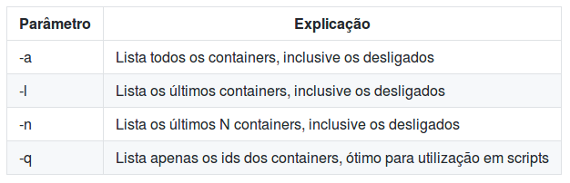

!SLIDE commandline incremental transition=scrollUp
# Rodando Comandos

Existem três contextos para execução de containers:

- Execução de Comandos em Foreground;
- Execução de Comandos com interação em Foreground;
- Execução de Comandos em longos em Background;  

!SLIDE commandline incremental transition=scrollUp
# Rodando Comandos

***Execução de Comandos em Foreground:***

Começando pelo básico:

    $ docker run debian ls

.callout.info `No exemplo acima executamos um comando simples dentro do container Debian, você verá como retorno uma lista dos diretórios dentro do container, após executar a solicitação o docker devera parar o container`

!SLIDE commandline incremental transition=scrollUp
# Rodando Comandos

Após a execução você conseguirá ver o container ( Que neste momento já foi finalizado ) com o comando do docker ps -a:

    $ docker ps -a

.callout.info `Como trata-se de um container que já executou a tarefa solicitada ( um simples comando ls ) o container não mais encontra-se em execução, por isso o uso do "-a" para verificar todos os containers, inclusive os que não estão rodando`

!SLIDE commandline incremental transition=scrollUp
# Rodando Comandos

Como o comando já foi finalizado o container pode ser removido executando o comando docker rm, para isso primeiro localizar o id do container:

    $ docker ps -a
    CONTAINER ID        IMAGE               COMMAND
    8c52b4a18f3c        debian:latest       "ls"                

Depois remova o container com base em seu id:

    $ docker rm 8c52b4a18f3c

!SLIDE commandline incremental transition=scrollUp
# Rodando Comandos

É possível remover um container automaticamente após sua execução:

    $ docker run --rm debian ping google.com

.callout.info `Finalize a execução utilizando um "Ctrl^C" procure pela imagem executando um "docker ps" o ping que estava sendo executado está rodando dentro do container`

!SLIDE commandline incremental transition=scrollUp
# Rodando Comandos

***Execução de Comandos interação em Foreground:***

Outra possibilidade para a execução de comandos é o uso do formato interativo a partir da emulação de um terminal como o "bash" ou o "sh":

    $ docker run --rm -i -t debian bash

.callout.info `Ao rodar comandos no modo interativo estamos efetivamente acessando o container, neste caso a partir do comando bash`

!SLIDE commandline incremental transition=scrollUp
# Rodando Comandos

***Execução de Comandos em longos em Background:***

Finalizando é possível executar containers em Background utilizando a opção "-d" neste exemplo o container a ser executado é uma nginx:

    $ docker run -d -p 8080:80 nginx

.callount.info `A opção "-p 8080:80" refere-se ao bind da porta 8080 do host local na porta 80 do container`

.callout.info `Como o container está sendo executado em uma camada de rede criada dentro do  host hospedeiro é necessário export da porta para acesso a aplicação`

!SLIDE commandline incremental transition=scrollUp
# Listando Containers

Abra um segundo terminal, visualize a lista de containers rodando:

    $ docker ps
    CONTAINER ID     IMAGE       COMMAND                   ...
    7b058f5b8a2c     nginx...    "nginx -g 'daemon ..."    ...

A relação de parâmetros para esse comando pode ser consultada abaixo:

!SLIDE commandline incremental transition=scrollUp
# Exibição de Logs

É possível obter logs de containers em execução com o comando docker logs 

***sintaxe:*** docker logs ${OPTIONS} ${CONTAINER_NAME}

    $ docker logs 7b058f5b8a2c
    
.callout.info `Uma boa prática ligada ao uso de containers indica que aplicações não devem gerenciar ou rotear arquivos de log, esse logs devem ser depositados sem qualquer esquema de buffer na saída padrão (STDOUT);`

.callout.info `Fica por conta de uma infraestrutura externa à aplicação o armazenamento e gerenciamento desses dados;`

!SLIDE commandline incremental transition=scrollUp
# Stateless vs Stateful

Ao utilizar plataformas baseadas em containers e modelos de [aplicações nativas para cloud](https://pivotal.io/cloud-native) existe uma classificação relativa a maneira como essas aplicações lidam com dados persistentes:

***Stateful:*** Chamamos de statefull as aplicações que  possuem persistência de dados de alguma forma como por exemplo banco de dados, ou soluções que armazenam informações de usuários, como controladores transacionais ou serviços;

***Stateless:*** Chamamos de stateless as aplicações que NÃO possuem persistência de dados como partes de microserviços ou páginas estáticas;

***Dica:***

[Este artigo](https://robinsystems.com/blog/stateless-vs-stateful-containers-1/) da robinsystems uma empresa que fornece paltaformas de cloud para bigadata possui um ótimo infografico sobre statefull x stateless;

!SLIDE commandline incremental transition=scrollUp
# Stateless vs Stateful

É muito comum que arquiteturas baseadas em containers e _cloud-native_ sejam compostas por ambos os tipos stateless e stateful, por exemplo um serviço de autenticação poderia possuir um container estático com a página de login que utiliza um backend [redis](https://imasters.com.br/artigo/18288/banco-de-dados/usando-o-banco-de-dados-nosql-redis-para-otimizar-sistemas-de-alta-escalabilidade?trace=1519021197&source=single) para persistência de dados da sessão;

.callout.info `No contexto descrito acima o uso de volume possibilitaria que vários containers rodando o redis utilizam uma mesma base, ou seja o ganho está na possibilidade de escalabilidade horizontal!`

!SLIDE commandline incremental transition=scrollUp
# Usando Volumes

O Docker possui um mecanismo para montagem e gerenciamento de volumes por parte dos containers, ou seja além do processo de binding de arquivos usando COPY e ADD é possível gerenciar conteúdo estático usando volumes, o que trás algumas vantagens em determinadas situações:

- Volumes são mais fáceis de fazer backup ou migrar;
- Podem ser manipulados usando o cliente do proprio Docker;
- Podem facilamente ser compartilhados entre vários containers;
- O uso de drivers permite a integração com paltaformas de cloud como AWS ou Google;
- Volumes podém ser pré-configurados e populados, (o que provavelmente é sua maior vantagem);

!SLIDE commandline incremental transition=scrollUp
# Usando Volumes

Para demonstrar a montagem de um volume utilizaremos um exemplo simples montando o conteúdo de um container php: 

Crie um diretório chamado ***php-vol***

    $ mkdir php-vol ; cd php-vol/

Popule este diretório com o arquivo ***index.php***:

    $ cat<<EOF > index.php
    <?php
    // Mostra todas as informações, padrão (INFO_ALL)
    phpinfo();
    ?>
    EOF

.callout.info `O phpinfo será utilizado para testar o uso do php mostrando seu atual estado e claro, será um ponto de montagem remota via volume para o documentroot do apache que por padrão lê arquivos index.*`

!SLIDE commandline incremental transition=scrollUp
# Usando Volumes

Verifique se o arquivo foi cirado conforme esperado:

    $ cat index.php
    <?php
    // Mostra todas as informações, padrão (INFO_ALL)
    phpinfo();
    ?>

Para testar volumes utilizaremos a imagem [php:7.0-apache](https://hub.docker.com/_/php/)

    $ docker run -d -p 80:80 -v \
    "$PWD":/var/www/html php:7.0-apache

.callout.info `Neste exemplo estamos montando o conteúdo do diretório corrente(nosso php-vol com o arquivo index.php) no diretório "/var/www/html"`

!SLIDE commandline incremental transition=scrollUp
# Usando Volumes

.callout.warning `IMPORTANTE: A instrução "-v" ou --"mount" do comando anterior especifica o diretório local a ser montado dentro do container, essa especificação deve ser um caminho absoluto, ou seja o caminho completo no filesystem do sistema operacional, logo caso não utiliza-se a variável $PWD a pesecificação seria algo conforme abaixo`

    $ docker run -d -p 80:80 -v \
    "/home/<nome-usuario>/php-vol":/var/www/html php:7.0-apache

.callout.question `Porque funciona com $PWD?: A varíavel $PWD aponta o caminho completo para o diretório atual no sistema linux, no momento da execução este era o diretório php-vol, esse tipo de recurso é muito útil na hora de automatizar seus processos de build;`