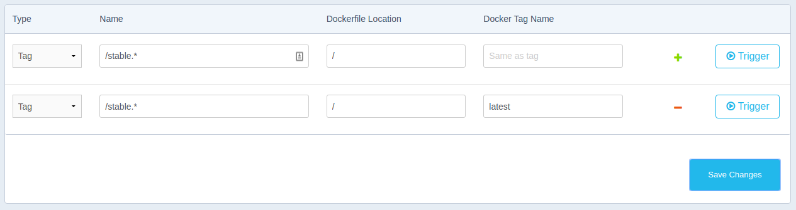

!SLIDE center transition=scrollUp

# Webhooks 

!SLIDE transition=scrollUp
# Conceito

- Webhook é o nome dado ao processo a partir do qual criamos gatilhos automaticos (as chamadas triguers) para que uma ação seja iniciada geralmente ao atualizarmos o código de uma aplicação;

- Existem várias maneiras de implementar webhooks, como por exemplo o processo de build de uma aplicação usando um CI ou em nosso caso o processo de build da imagem a partir de uma atualização no código;

!SLIDE transition=scrollUp
# Criando um Webhook;

Para este exemplo criaremos um processo de build automático para a imagem em node criada anteriormente, para que o teste funcione duas contas serão necessárias:

- Uma conta no [github](https://github.com) ou [bitbucket](https://bitbucket.org/);

- Uma conta no [Dockerhub](https://hub.docker.com/);

!SLIDE transition=scrollUp
# Criando um Webhook;

Tendo acesso as duas contas citadas faça um push do conteúdo dos testes com node [disponíveis neste endereço](https://github.com/fiapsecdevops/mini-curso-docker/raw/master/_files/share/node-js-sample.zip) como um novo repositório no seu github, caso já possua um repositório com conteúdo similar ele poderá ser usado;

Em seguida faça login no DockerHub e crie um webhook simples conforme as [instruções dessa documentação](https://docs.docker.com/docker-hub/builds/);

!SLIDE transition=scrollUp
# Criando um Webhook;

.callout.info `Siga cuidadosamente a documentação para criar um processo de build simples, uma vez finalizado faça um update no master e após alguns minutos verifique novamente seu repositório no dockerhub;`

.callout.question `Com relação ao uso de tags existem várias possibilidade interessantes, uma delas é vincular a tag do repositório no github a tag no Dockerhub conforme imagem abaixo.`

